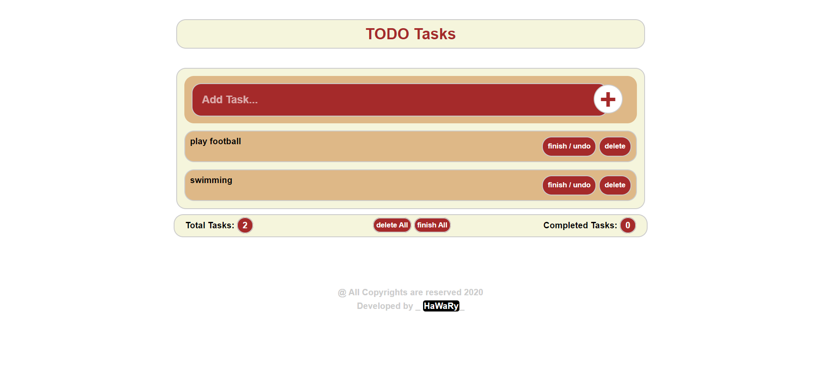

# TODO Tasks  
  

TODO Tasks is an Task List App. let you organize and add your Tasks in a Smart List.  

## Demo and How to Interact  

  
 

## Getting Started

You can try APP from [here](https://mohamed-elhawary.github.io/todo-tasks/)

### Prerequisites

Just Modern Browser like "Chrome" and a Code Editor for Deployment and Develop.

## Built With

* HTML5
* CSS3
* Pure JS (No Plugins)

## Author

* Mohamed Elhawary  

## Contact Me  

* Email: mohamed.k.elhawary@gmail.com

## Deploy with Me

Feel free to deploy it with me, send Issues or a pull request and i'll deal with you, just test it first.

## License

Licensed under the [MIT License](LICENSE)

